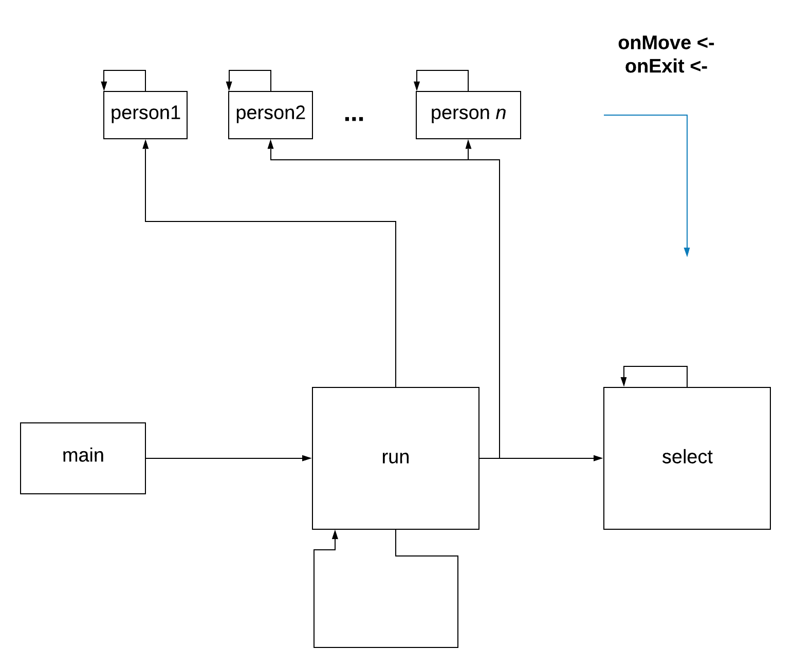

# Requiremtents
`go get github.com/faiface/pixel`

`go get github.com/faiface/glhf`

`go get github.com/go-gl/glfw/v3.2/glfw`
- on macOS only: xcode-select --install

# Threads
- main thread executes the run method
- the run method executes each person's goroutine
- the run method executes the select statement within an anonimous goroutine
- each person communicates through the `onMove` and `onExit` channels to the select statement
- the run method keeps executing an update method to re-render the canvas

# Libraries
* built-in
  * bufio
  * fmt
  * math
  * math/rand
  * os
  * strconv
  * strconv
  * strings
  * time
* installed
  * [pixel](https://github.com/faiface/pixel)
    * pixel/imdraw
    * pixel/pixelgl
    * pixel/text
  * [colornames](https://godoc.org/golang.org/x/image/colornames)
  * [font/basicfont](https://godoc.org/golang.org/x/image/font/basicfont)
# Structs
* coordinate
  * row (int): x coordinate, or row number
  * col (int): y coordinate, or column number
* person
  * id (int): person's id
  * speed (float32): person's slowness, the bigger the slower
  * exited (bool): wheter a person has reached the exit or not
  * path ([]coordinate): the path to the exit represented as an array of coordinates
  * position (int): number of places moved from the starting point
  * curr_position (coordinate): current coordinate where person is
# METHODS
* initializePast()
* printBuilding()
  * Prints the building matrix
* printPast()
  * Prints the past, which is a matrix indicating which are the cells forming the exit path of a person.
* printPathMatrix()
  * Prints the matrix that represents the path of a person in the matrix
* getNumOfPeople()
  * Function that counts the number of people in the building matrix
* generateExits(floor [][]int)
  * Function that receives building matrix, and randomly generates a random number of exits on its borders
  * Parameters
    * floor ([][]int): matrix that represents the map of the building
* insertExit(floor [][]int, sideExits []int, side int, indexExit int, lenF int) bool
  * Function that inserts an exit on a random position of the border of the matrix
  * Parameters
    * floor ([][]int): matrix that represents the map of the building
    * sideExits ([]int): an array that has a counter of exits for each border
    * side (int): the border where the exit is going to be inserted (0 up, 1 right, 2 down, 3 left)
    * indexExit (int): the index where the exit is going to be inserted
    * lenF (int): The length of the side of the matrix
  * Returns
    * bool: returns true if the exit was inserted, returns false if it was not
* distance(a coordinate, b coordinate) float64
  * Finds the distance between two coordinates
  * Parameters
    * a (coordinate): First coordinate
    * b (coordinate): Second coordinate
  * Returns
    * float64: The distance between a and b
* findClosestExit(position coordinate) int
    * Uses distance function to return the index of the exit coordinate closest in distance to the initial position of a person.
* validate(row int, col int) bool
    * Checks if a cell in the building matrix is viable to be part of the exit path of a person.
* searchPath(row int, col int) bool
    * Generates the coordinates that conform the path of a person.
* searchPathRec(row int, col int, e int) bool
    * Does backtracking using recursion to find the exit path of a person.
* createWindow() \*pixelgl.Window
* drawFloor(win \*pixelgl.Window) \*imdraw.IMDraw
* drawPeople(win \*pixelgl.Window) \*imdraw.IMDraw
* printLabels(win \*pixelgl.Window)
* run()
  * Generates the simulations, initializes the people, calls to generate the exits and the exit paths for the people and starts the go routines. It has a select that manages all the go routines, and when all the go routines end, this function stops the program.
* movePerson(p person)
  * Moves a person to its next position on its path atribute
  * Paratemters
    * p (person): The person that is going to be moved
* generateRandomSpeed() float32
  * Generates a random speed for a person
  * Returns
    * float32: The speed generated
* initiatePerson(p person, onMove chan person, onExit chan person, trapped []person)
  * Function used to interact with each person's go routine, it manages if it moves or if it exits
  * Parameters
    * p (person): The current person
    * onMove (chan person): The channel that moves the person
    * onExit (chan person): The channel that exits the person
    * trapped ([]person): An array containing all the people in the building at the start of the simulation
* main()
